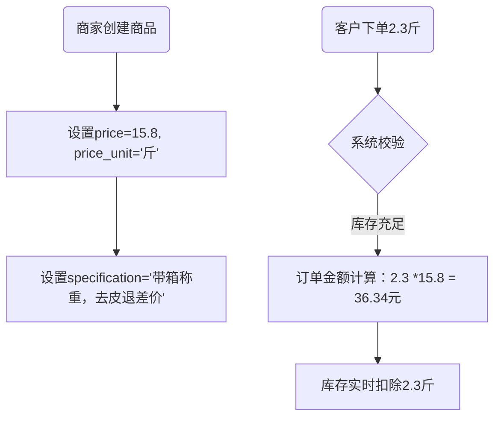

# 基于Springboot的鲜果商场网站设计与实现

## 网站是做什么的

> 首先，肯定是卖水果。或许等同于贩卖东西，商家挂东西，客户买就行了。那么假设有这两大类，是否需要搞不同商家呢？搞得话或许好一些，这样的话就是有三方角色：网站管理员、供货商（卖家）、客户（卖家）
>
> 至于是否要设置店铺，感觉暂时还没这个需求，毕竟卖的只有水果，用店铺区分好像没啥意义

- 类似于淘宝的模式，供货商在网站上挂东西，买家填写地址、需求量等信息，然后达成交易
- 由于供货商不同，营销策略和价格因而各不相同，应该没法和水果直接相关

> 简单的情况，当然是希望商家，买家，管理员都位于系统的user表，商家是否存在账号以外的信息呢？一个买家主要关联的是订单，卖家则是主要发布产品信息...按理说这样只需要根据user_id列举。只用user是否能代称所有的角色呢？这个表实际上根据不同权限分配菜单
>
> 感觉再加一个拓展表相当于扩充的生态？
>
> 换个思路，user_id是从账号层面上为其赋予权限，其自创用户需要手动为自己争取角色（比如商家），所以有两种实体吗？账号实体和业务角色实体
>
> 突然有个新的思路，本来一个商家就要拥有多个产品，将这样的一个集合统称为店铺，店铺id作为产品的外键约束即可

## 一些实体

公共字段

- 创建时间、修改时间、创建人、修改人

详细设计规则

- 根据提供表名，整理好全部字段并按照一定模板输出，方便我做笔记
- 给出包含有具体数据类型、约束等的建表语句
- 结合表与表字段涉及的业务（全局的全部业务），给出简洁但充足的注意事项
- 以上三条要求的信息分开输出

### tb_category

- ***分类表***，作为产品的分类（tb_category）

  - 主键约束 -- category_id

  - 品类名称 -- category_name

    - 唯一
    - 其实更具体的名称应该由商家来定义，像苹果A、苹果B来个通称 苹果 即可 

  - 分类来源  -- source_type

    - 定义分类来源于 系统 还是 商家

  - 审核状态 -- audit_status

    - 0待审核 1已通过 2已拒绝
    - 对于系统分类默认通过

  - 审核备注 -- audit_comment
  
    - 记录管理员拒绝时提供的理由
    - 允许为空
  
  - 科普描述 -- category_desc
    - 科普类型的描述，是否要包含营养和特色还没想好，感觉应该由商家提供才好
  
    - > [!NOTE]
      >
      > 富文本扩展

> - 提供一些大类可供选择
>   - 毕竟是鲜果网站，根据这个分大类之后应该会有很多用户友好型的拓展空间，比如根据一些要素进行大类推荐
> - 分类类型避免分类的一些混淆
>   - 理论上水果种类不多，应该全部由系统提供
>   - 但或许商家也会搞一些新奇的分类，让商家自己写个大类，然后由管理员审查接纳也挺好的
>     - 如果是商家分类，会进行一定的限制，并且提示语“请注意甄别”
>   - 标签表是否需要搞分类类型呢？好像没什么意义

***

### tb_product

- ***产品表***，最小单元的商品 （tb_product）

  - 主键约束 -- product_id
  
  - 产品名称 -- product_name
    - 比如苹果A、苹果B这样的区分

  - 产品编号 -- product_code

  - 产品图片 -- main_img

    - 归纳到file表
    - 冗余存储
      - 同时还会关联查询轮播图
  
  - 规格数值 -- specification_value
  
    - 数值
  
  - 规格数值单位-- specification_unit
  
    - g、kg、jin
    - 由工具类动态计算
  
  - 计价单位 -- price_unit
  
    - 对应规格，填盒/个/斤（散装称重）
  
  - 产品价格 -- price
  
    - 单位规格下的价格
  
  - 单位价格 -- unit_price
  
    - 动态计算，仅用于统计或排序
  
  - 库存数量 -- stock
  
    - 为0时应当自动触发产品状态改变
  
  - 库存预警 -- stock_alert
  
    - 达到时触发变化
    - 针对所有产品
  
  - 产品销量 -- total_sales
  
    - 仅用于统计或排序
    - 每次订单交易改动该字段
  
  - 产品状态 -- product_status
  
    - 记录是否上架等状态
    - 0：上架、1：下架、2：售罄
    - > [!NOTE]
      >
      > 随后扩
  
  - - -
  
  - 平均评分 -- avg_rating
  
    - 后台计算
  
  - 评价数量 -- review_count
  
  - 店铺名称 -- store_name
  
    - 冗余字段，在店铺表更新时需要同步更新
  
  - 产品描述 -- product_desc
  
    - > [!NOTE]
      >
      > 富文本待扩展
  
  - ***店铺id***    -- store_id
  
    - 逻辑外键
    - 或许旨在构造一个轻量化的网站，每一个用户都能够投放自己的产品，以店铺作为约束
  
  - ***分类id***  -- category_id
  
    - 逻辑外键
    - 创建时被选择，不为空

> - 交易物的最基本单元，product_code为外部显示的唯一识别码，可用于订单上
>
> - 产品状态主要涉及商家与旗下产品的关系，比如下架、库存不足、正常等等
>
>   - 随后扩展
>
> - 产品描述搞个富文本比较好，但还不太懂，之后扩展
>
> - 店铺id + 产品名称 联合唯一约束
>
>   - 同一店铺不能上传同一名字
>
>   - > [!NOTE]
>    >
>     > 
>
> 

***

### tb_store

- ***店铺表***，以“商家”为角色隔离产品的集合（tb_store）

  - 主键约束 -- store_id
  
  - 店铺编号 -- store_code
  
    - 唯一
    
  - 店铺图标 -- store_logo
  
    - 归纳到file表
    - 冗余存储
    
  - 店铺名称 -- store_name
  
    - 唯一
    
  - 店铺描述 -- store_desc
  
    - > [!NOTE]
      >
      > 富文本待扩展
    
  - 运营状态 -- store_status
  
    - 0：待审核
      - 管理员审核信息后进入营业
      - 此时用户不应当具备“卖家”角色
    - 1：营业中
    - 2：停业中
      - 主动设置
      - 无法交易
    - 3：封禁中
      - 一般用户不可查看店铺主页、不可交易
      - 被动设置，可提交申诉进入待审核
    - 4：已注销
      - 主动注销
    
  - 联系电话 -- contact
  
  - 申请标记 -- audit_flag
  
    - 0：未申请
      - 每次操作员处理完，1->0，不会再出现在待审核列表
    - 1：已申请
      - 初始申请时默认为1，后续需要用户主动点击“申请”按钮，才会更新
    - 会有一个页面标识，这个标识在”待审核“”封禁中“时才考虑可用性
  
  - 审核备注 -- audit_comment
  
    - 将作为一个重要标识
    - 假如为空，那么其一定需要再次审核
    - 同时也能存储封禁理由，会有一个固定前缀
  
  - ***用户id***     -- user_id
  
    - 逻辑外键
    - 唯一，一个用户只能创建一个店铺

> - 实际上相当于“商家”业务延伸出来的实体
>   - 这是由于不打算更改user表的缘故
>   - 同时意味着，需要具备“商家个人”的一切信息
>     - 相当于联系客服
> - contact字段感觉可以有很多类型
>   - 邮箱、电话等，但这些或许放在描述里比较好，这里先电话吧
> - 店铺编号作为外部显示的唯一标识，可用于订单信息、前端页面等信息补充
> - 店铺状态
>   - 可以有是否验证、是否营业等

***

### tb_tag

- ***标签表***，为产品提供灵活的标签选择（tb_tag）
  - 主键约束 -- tag_id
  - 标签名称 -- tag_name
    - 唯一

> - 是否要区分系统和商家提供呢？感觉暂时没太大必要

***

### tb_product_tag

- ***产品-标签关系表***，多对多的关系分离(tb_product_tag)
  - 主键约束 -- product_tag_id

  - ***产品id*** -- product_id
    - 联合主键
    - 逻辑外键

  - ***标签id*** -- tag_id
    - 联合主键
    - 逻辑外键

> - 多多关系对应出来的实体

***

### tb_address

- ***地址表***，用户个人信息存储（tb_address）

  - 主键约束 -- address_id
  - 电话         -- contact
  - 性别         -- gender
  - 收货人     -- consignee
  - 省份        -- province
  - 城市        -- city
  - 区县        -- district 
  - 详细地址 -- detail_address
  - 地图选址 -- location

    - > [!NOTE]
      >
      > 未来看
  - 默认标记  -- is_default

    - 该地址是否为默认地址
    - 0：否；1：是
  - ***用户id***     -- user_id
    
    - 逻辑外键，一个用户可以对应多条地址记录

> - “买家”业务延伸出来的实体，

***

### tb_cart_item

- ***购物车项表***，存储用户的购物车中的每项记录（tb_cart_item）
  - 主键约束 -- cart_item_id
    - 唯一确定一条购物车记录
    - 仅依靠 用户id + 产品id 会导致“多次添加同一产品”的混淆
  - 产品名称 -- product_name
    - 冗余字段
  - 产品图片 -- product_main_url
    - 冗余存储
  - 产品数量 -- quantity
    - 支持增减，动态修改
  - 产品金额 -- product_price
    - 产品单价快照
  - 选中状态 -- is_selected
    - 持久化存储选中状态
    - 0：未选中，1：选中
  - ***产品id***     -- product_id
    - 外键约束
  - ***用户id***     -- user_id
    - 外键约束

***

### tb_order

- ***订单表***，用户购买产生订单（tb_order）
  - 主键约束 -- order_id
  - 订单编码 -- order_code
    - 用于外部显示的唯一编码
  - 父订单号id -- parent_order_id
    - 关联同一次购物行为产生的多笔订单
    - 跨店铺订单自动生成，单店铺为空
    - 不作为实际记录存在
  - 订单状态 -- order_status
    - 0：保留字段（后期可替换成“待支付”）；
    - 1：待发货
    - 2：待收货
    - 3：待评价
    - 4：已完成
    - 5：已删除
    - 6：已取消
  - 订单总额 -- total_amount
  - 省份        -- province_snapshot
  - 城市        -- city_snapshot
  - 区县        -- district _snapshot
  - 详细地址 -- detail_address_snapshot
  - 收件人    -- receiver_snapshot
  - 收件人电话-- contact_snapshot
  - 订单备注 -- order_remark
    - 允许为空
  - *** 地址簿id***  -- address_id
    - 逻辑外键
  - ***用户id***     -- user_id
    - 逻辑外键，下单用户
  - ***店铺id***     -- store_id
    - 逻辑外键，一笔订单只能对应一个店铺

***

### tb_order_detail

- ***订单详细表***，保留订单的详细记录/提交的购物车信息快照（tb_order_detail）
  - 主键约束 -- order_detail_id
  - 产品名称 -- product_name_snapshot
  - 产品主图 -- product_main_url_snapshot
  - 产品数量 -- quantity
  - 产品金额 -- product_price_snapshot
  - 订单总额 -- total_amount
  - 产品规格 --price_unit_snapshot
  - *** 订单id***      -- order_id
    - 逻辑外键
  - *** 产品id***      -- product_id_snapshot
    - 逻辑外键 
    - 但这个产品可能被删除，因此依旧是一种快照

***

### tb_file

- ***文件表***，（目前）主要存储各种头像或者logo
  - 主键约束 -- file_id
  - 业务类型 -- biz_type
    - biz是business的缩写
  - 业务id    --  biz_id
    - user_id、store_id、product_id
  - 存储路径 -- storage_path
    - 完整路径
  - 主图标记 -- is_main_image
    - 特别用于“产品宣传图”，同一产品只能由一张主图

> - 统一存储一切上传文件（基本都是图片）
>
> - 业务类型需要上传或者使用时手动添加
>
>   - > [!NOTE]
>     >
>     > 假如写的很麻烦的话，可以试试切面方法，这样就对命名有要求了
>
>   - 这里直接使用表名是否好呢？这样对应表名+主键肯定唯一，就可以无脑添加了
>
> - 一般由业务类型+id就能唯一确定图片，但也有一个id对应多图情况（主图标记）
>

***

### tb_favorite

- 收藏表，记录用户的一项收藏产品

  - 主键约束 -- favorite_id
  -   ***用户id*** -- user_id
    - 逻辑外键

  - ***产品id*** -- product_id
    - 逻辑外键

> - 多对多关系延伸表
> - 通过user_id查询产品列表，再通过其查询产品信息

***

### tb_review

- 评价表，订单完成后用户对某一产品的评价
  - 主键约束 -- review_id
  - 评价内容 -- content
  - 评价等级 -- rating
  - ~~评价图片 -- review_img~~
    - 存储在file表
  - is_anonymous
    - 0：不匿名；1：匿名
  - ***用户id***    -- user_id
    - 逻辑外键
  - ***订单id***   -- order_id
    - 逻辑外键
    - 购买后才可评价

> - （暂设）评价相对于某一订单存在（即使存在多个商品），一对一对关系

***

### tb_statistics_daily

- 日统计表，多维度统计当日各项数据
  - 主键约束 -- statistics_daily_id
  - 统计类型 -- record_type
    - 0：商品
    - 1：店铺
    - 2：分类
  - 统计日期 -- statistics_date
    - 定时任务可能发生在第二天，所有需要额外记录
  - 业务id   -- biz_id 
    - 对应三种类型表的id
  - ~~浏览量  -- daily_view~~
  - 销售量  -- daily_sales
  - 收藏量  -- daily_favorites
  - 下单量  -- daily_orders
  - 评价量  -- daily_reviews
  - 评分和  -- daily_rating_sum

> - 核心在于商品统计
>   - 统计商品后，店铺/分类都可以通过商品得出
>   - 浏览量：待扩展
>   - 销售量：当日订单对应的订单详情中，该商品的数量
>   - 收藏量：减去前一天商品收藏数量
>   - 下单量：包含该商品的当日订单数量
>   - 评价量：发生在当日评价并且是该商品的数量
>   - 评分和：发生在当日评价并且是该商品数值之和
>     - 可用于计算平均评分

***

> [!TIP]
>
> - 

## 业务场景 -- 商家视角

### 我的店铺05

> - 所有人均可显示该菜单
> - 包含一个固定的storeId参数，即只要有人访问这个页面，就一定会提交这个参数
>
> 

- 限定在该店铺的产品榜、分类榜
  - 【信息展示】类似于用户的热度追踪，只是全部限定在该指定店铺下
  - 【业务】
    - 跳转操作
      - 点击产品可进入产品详情页
    - 排序条件
      - 销量、收藏、评价
    - 时间维度
      - 日月周
- 店铺信息展示√
  - 【信息展示】店铺编号、店铺图标、店铺名称、店铺描述、运营状态、联系电话、申请标记、审核备注
  - 【业务】
    - 支持信息修改
      - 更新店铺图标、名称、描述、联系电话
      - 更新运营状态
        - 若处于营业/停业状态，可通过图标按钮便捷切换切换，切换后图标也随之改变
        - 若处于其他异常状态，则不会展示该图标
    - 前端合理布局√
      - 保证像一个宣传页一样进行布局
      - 运营状态设置为一个状态进度条
      - 申请标记要做成一个按钮，通过点击更新申请标记（也采用图标切换的方式）
        - 其仅在异常状态时有效
        - 正常状态，显示非申请图标，但不可操作

### 店内商品06

> - 只有商家才能看到该界面

- 根据store_id限定查询产品（表格布局）√
  - 【信息展示】产品名称、编码、主图、价格、产品状态、库存、产品销量、评价
    - 支持搜素
      - 搜索条件：产品名称、产品编码
    - 支持排序
      - 排序条件：销量、评价、库存等
    - 根据产品状态有不同显示栏 全部-上架-下架-售罄-预警
      - getList要求必须传递isAlert标记，后端进行检查并选择性返回
      - 每次一定传递，只有在调查预警产品时赋true，其他为false
    - 库存低于预警值显示提示样式
    

- 跳转操作√
  - 点击“查看详情”，进入产品详情页，显示全部信息
  - 包含分类、标签
    - 分类前端给就行
      - 要求分类全都是已通过的
    - 标签由于涉及三个表，因此此处交给后端。传回产品数据+标签名称
- 提交分类√
  - 填写信息
    - 名称、描述
  - 校验
    - 名称唯一（后端校验）
  - 后端处理
    - 填写分类来源（商家）、审核状态（待审核）
- 新增产品√
  - 填写信息
    - Product实体、多张图片、多个标签
    - 名称、图片、规格数值、规格数值单位、计价单位、价格、库存、分类、预警值、标签
      - 注意：此处可以上传多张图片，并且给出提示，第一张图作为产品主图，其他作为轮播图
        - 此时mainImg将多个图片URL用逗号连接成字符串
    - 分类由下拉框进行选择，选择名称，实际值为id
    - 标签从一个可供选择的区域中中可以选择多个，选择名称，实际值为id
  - 【业务】
    - 校验
      - 关联人与当前操作用户一致
      - 名称在该店铺内唯一
      - 数值和其他空校验交给前端
      - 图片不为空
    - 后端填写字段
      - 产品编号、单位价格、产品状态设置为1
      - 多图片存储
        - 冗余存储+file储存
      - 存储产品-标签关系
- 编辑产品√
  - 编辑项和新增表单一致
  - 【业务】
    - 校验
      - 产品id存在且合法，且关联人与当前操作用户一致
      - 名称唯一（更新分支）
      - 其他前端校验同新增
    - 更新
      - 多图片存储
      - 产品-标签关系
- 删除
  - 校验
    - id合法，且关联人与当前操作用户一致

### 店内订单11

- 根据user_id查询订单列表以及对应的订单详情信息

  - 【信息展示】以订单为基本单元展示订单信息：订单编码、订单状态、订单总额、订单备注、店铺编号、店铺名称
    - 订单作为基本的展示单元，有两个扩展展示按钮
      - 一个点击后，展示订单有关的地址信息
      - 一个点击后，展示订单关联的各项详情项：展示除主键id、订单id、产品id外的信息
    - 若某订单存在父订单号parent_order_id，那么将具有同一个父订单号的订单作为一组展示
      - 简而言之，整个展示页面根据父订单号进行分组展示
        - 无父订单号的单独成组
          - 因为没有父订单号，因此与“有父订单的分组”样式稍有不同
        - 有订单号的根据getOrder方法，传递父订单号，获取父订单号的订单编码，作为分组展示标识
      - 父订单号只是一种分组标识，排除在基本的展示单元之外
  - 【端点】
    - /manage/order/list-store/{storeId}  (GET)
  - 【业务】
    - 支持搜索
      - 搜索条件：订单编号（模糊匹配，前端实现）
      - 根据订单状态显示，预先设置几个按钮，比如“全部”“待发货”....
    - 分页展示

- 各个订单对应不同的操作按钮

  - 更新订单进入下一个状态

    - 待发货 -- 进行发货

    - /manage/order（POST）
    - 前端传递订单id和应当进入的新状态

- 需求api：order、

## 业务场景 -- 买家视角

> - 虽然说是买家，但实际上所有用户都拥有这样的逻辑，因此从这里设计业务比较好
>

### 浏览商品06

- 根据搜索条件查看全网站的产品（网格布局）√
  - 【信息展示】展示主图、产品名称、归属店铺、规格、单价、评分、三个以内的标签
  - 【业务】
    - 默认条件：product_status=已上架(暂时取消该限制)
    - 搜索条件：价格区间、标签（多选）、店铺（模糊）、产品名称（模糊）、分类
      - 价格区间，规定左小右大（可只填一方），不能为负数
    - 分页展示
    - 排序条件：规格价格、单位价格、销量、上架时间、评分
      - 价格需提醒规格价格和单位价格的区分
- 点击某一条记录“查看详情”进入商品详情页√
  - 【信息展示】轮播图 + 所有信息（Product + 关联的标签信息）
    - 【备注】
      - 轮播图
        - 获取全部图片列表的方式参考product/index文件中的handleUpdate
      - 需要充分考虑各个业务逻辑和需求，设计出美观大方的商品详情/购买页
- 分类科普信息：仅支持审核通过的√
- 收藏功能：加入“我的收藏”√
  - 点击后生成一条收藏记录
- 分享功能：生成url（也可组装成
  一个文本，像是腾讯会议一样）√
- 评价列表：展示该产品的评价内容√
  - 【信息展示】用户表：用户名称+用户头像、评价内容、评价照片、评价等级
  - 根据产品id获取评价列表
    - 一条评价唯一关联一个订单(且一定不是父订单)，连接条件为订单号
    - 订单关联多条购物记录，连接条件为订单号
    - 这种情况下用产品id筛选
- 订单/加入购物车确认对话框√
  - 【按钮】
    - 在商品信息的适当位置存在两个按钮，“加入购物车/购买”
    - 两个按钮复用同一个对话框，只是相关的文字说明以及相关确认按钮触发的事件不同
  - 【信息回显】
    - 地址信息√
      - 回显在上部，默认仅显示默认地址，点击后可展开地址列表，进行地址的选择，并且有“管理/新增地址按钮”
        - 其中管理按钮，用于设置默认地址或删除地址或编辑地址(删除有确认对话框)
      - 若未查询到数据应当显示对应地说明文本，且点击后进入新增界面
      - 【回显--端点】√
        - /manage/address/list/{userId} (GET)
        - 触发：点击“加入购物车/购买”
        - 前端传递用户id，返回的理想数据中的rows应为若干条数据，其中有且一条数据的is_default为1(即应当仅存在一个默认地址)
        - 后端
          - 【校验】
            - 关联数据是否合法(仅存在一个或不存在默认地址)
      
          - 【处理】
            - 返回数据
      - 【管理--端点】√
        - /manage/address/default/{addressId}  (PUT)
        - 触发：地址回显区域点击“管理”按钮后，通过单选框切换“默认地址”时
        - 前端传递地址项的addressId
        - 后端
          - 【校验】
            - 地址id合法
      
          - 【处理】
            - 获取用户的所有地址数据，除选定id外其他默认标记置0
      - 【删除--端点】√
        - /manage/address/{addressds}  (DELETE)
        - 触发：点击某项的删除选项时
        - 前端传递地址项的id（由于复用了后端批量删除按钮，因此要作为数组的一部分传递）
        - 后端
          - 【校验】
            - id合法
          - 【处理】
            - 删除默认地址时，默认地址将无法删除
            - 删除
      - 【新增--端点】√
        - /manage/address  (POST)
        - 触发：地址回显区域点击“新增地址”按钮后，填写信息后提交表单时
        - 前端传递除两个id和默认标记以外的基本信息
        - 后端
          - 检查用户之前是否存在地址记录，若不存在则设置默认标记为1，否则为0
          - 新增数据
      - 【修改--端点】√
        - /manage/address（PUT）
        - 触发：地址回显区域点击“编辑地址”按钮后，填写信息后提交表单时
        - 前端传递除用户id和默认标记以外的基本信息
        - 后端
          - 检查id与操作者一致
          - 更新
    - 商品信息√
      - 主图展示，当前价格(结合数量计算)，可选数量，以及规格等辅助购买的参考信息
      - 数据可直接使用初始化时获取到的productInfo等数据
      - 并且提供一个可以填写备注的地方（对应Order实体的orderRemark属性）
    - 底部确认按钮√
      - 根据点入“加入购物车/购买”显示不同的文字按钮，根据点击不同的文字按钮触发不同的事件
      - 加入购物车√
        - 新增当前用户的购物车项记录
        - 【新增--端点】√
          - /manage/cart-item（POST）
          - 前端传递除主键id和选中状态外的全部数据
          - 后端
            - 【校验】
              - 产品id存在且合法、检查用户id和当前操作者是否一致
            - 【处理】
              - 设置选中状态为0
              - 新增数据
      - 购买√
        - 直接生成订单(仅绑定了单一产品)，以及一项对应的订单详情数据（根据前一个请求结束后返回的订单生成后返回的数据发出请求）
        - 【新增订单--端点】√
          - /manage/order（POST）
          - 前端传递订单总额（前端自行计算），省份、城市等与地址有关属性，订单备注，用户id，店铺id，地址簿id
            - 携带一个附加参数parent:false
          - 后端
            - 【校验】
              - 店铺id存在且合法，地址簿id存在且合法
            - 【填写】
              - 订单编码、父订单号(为空，由附加参数parent得知)、订单状态为待发货
        - 【新增订单详情--端点】√
          - /manage/order-detail（POST）
          - 前端传递除主键id以外的全部数据
          - 后端
            - 【校验】
              - 订单id、产品id合法
            - 【处理】
              - 新增
- 点击店铺，跳转到专门的店铺商品列表（类似于商家端视角都没有权限）√

### 我的购物车07

- 按照用户id查询查询对应的购物车项（条状布局，参考购物网站购物车）√
  - 【信息展示】主图、产品名称、产品数量、各项金额 + 总金额（前端计算）
  - 【业务】
    - 按店铺分组展示，显示店铺名称√
    - 选择操作(前端记录选中状态，特定时刻向后端发送)√
      - 单个商品选择、店铺商品全选、全部商品全选√
      - 选择后自动计算总金额√
      - 后端记录is_selected√
        - 在结算、离开/刷新界面、定时发送请求
        - 这样初始选中状态由后端数据决定
      - 【更新isSelected--端点】√
        - /manage/cart-item/changeSelected/{cartItemId}(PUT)
        - 前端传递购物车项id，后端将切换isSelected的值
      
    - 支持数量操作√
      - +1、-1
        - 每次校验库存，不能超出最大限制
    
      - 自动计算金额
    
    - 删除操作√
      - 单个商品删除、批量删除、清空购物车
        - 共用delCartItemAPI方法，根据不同情况传入不同的数组
      
    - 点击查看详情后，进入商品详情页√
    - 点击店铺后，进入店铺界面√
    - 状态处理√
      - 商品下架提醒、库存不足提醒、店铺状态提醒
      - 异常状态自动取消选择
    
    - 支持加入收藏√
    
    - 分页功能√
  
- 点击“结算”后进入订单确定界面√
  - 【信息展示】
  
    - 选中商品总览（小票样式）
      - 按照店铺分组，显示各自的总览信息（设计成传统小票的样式）、细分金额等
    - 地址信息
      - 完全参考brosw-detail中的地址信息展示
      - 下引当时的需求（请注意此处的位置应当在小票下）
    - 总价等一些最后的确认区域
  
  - 【业务】
    - 结算校验
  
    - 拆分订单
      - 按照店铺自动拆分多笔订单，分别发送创建订单的请求
  
        - 同理，对于订单下涉及的每个产品，逐个创建每个订单详情
  
        

### 我的收藏09

- 根据user_id查看favorite表，一一列举商品（网格布局）√
  - 【信息展示】√
    - 基础信息：主图、产品名称、价格、规格
    - 店铺信息：店铺名称、店铺状态
    - 商品状态：上架状态、库存状态、评分、关联标签
    - 【端点】
      - /manage/favorite/list（GET）
  - 商品跳转操作√
    - 点击“查看详情”，进入详情页
    - 点击“店铺”，进入店铺页
  
  - 支持取消收藏√
    - 实际上就是删除一条收藏，传递收藏记录的id
  - 支持搜索√
    - 搜索条件：产品名称、店铺名称
  
  - 支持排序√
    - 排序条件：收藏时间、价格、评分
  - 批量操作√
    - 对于选中项批量删除
  - 分页功能√
  - 状态提醒√
    - 商品下架、库存不足、店铺异常

### 我的订单10

- （目前的设定是只要交易就马上支付完成）

- 根据user_id查询订单列表以及对应的订单详情信息√

  - 【信息展示】以订单为基本单元展示订单信息：订单编码、订单状态、订单总额、订单备注、店铺编号、店铺名称√
    - 订单作为基本的展示单元，有两个扩展展示按钮
      - 一个点击后，展示订单有关的地址信息
      - 一个点击后，展示订单关联的各项详情项：展示除主键id、订单id、产品id外的信息
    - 若某订单存在父订单号parent_order_id，那么将具有同一个父订单号的订单作为一组展示
      - 简而言之，整个展示页面根据父订单号进行分组展示
        - 无父订单号的单独成组
          - 因为没有父订单号，因此与“有父订单的分组”样式稍有不同
        - 有订单号的根据getOrder方法，传递父订单号，获取父订单号的订单编码，作为分组展示标识
      - 父订单号只是一种分组标识，排除在基本的展示单元之外
  - 【端点】√
    - /manage/order/list-user/{userId}  (GET)
  - 【业务】√
    - 支持搜索
      - 搜索条件：订单编号（模糊匹配，前端实现）
      - 根据订单状态显示，预先设置几个按钮，比如“全部”“待发货”....
    - 分页展示

- 各个订单对应不同的操作按钮√

  - 更新订单进入下一个状态

    - 待发货 -- 取消订单
    - 待收货 -- 确认收货
    - 待评价 -- 进行评价
      - 点击“进行评价”后，出现一个评价对话框
        - 填写内容、等级
        - 前端补足用户id和订单id后向后端创建评价

    - 已完成 -- 进行删除/再次购买
      - 再次购买：将该产品添加到购物车，使用api方法addCartItem

  - 【更新按钮端点】

    - /manage/order（POST）

    - 前端传递订单id和应当进入的新状态

    - 后端

      - 校验

        - 订单id合法

      - 业务逻辑

        - 确认收货：仅支持“待收货” -> "待评价"

        - 取消订单：仅支持“待发货” -> "已取消"
        - 删除订单：仅支持“已完成”或者“已取消”或者“待评价” -> "已删除"
          - 若为“待评价”，提醒并确认“即使未评价也要删除吗”才会删除
        - 评价商品：仅支持“待评价” -> "已完成"

- 需求api：order、cart-item、review

  

  

### 我的地址簿08

- 默认仅显示默认地址，点击后可展开地址列表，进行地址的选择，并且有“管理/新增地址按钮”

- 其中管理按钮，用于设置默认地址或删除地址或编辑地址(删除有确认对话框)

- 若未查询到数据应当显示对应地说明文本，且点击后进入新增界面
- 【回显--端点】√
  - /manage/address/list/{userId} (GET)
  - 触发：点击“加入购物车/购买”
  - 前端传递用户id，返回的理想数据中的rows应为若干条数据，其中有且一条数据的is_default为1(即应当仅存在一个默认地址)
  - 后端
    - 【校验】
      - 关联数据是否合法(仅存在一个或不存在默认地址)

    - 【处理】
      - 返回数据
- 【管理--端点】√
  - /manage/address/default/{addressId}  (PUT)
  - 触发：地址回显区域点击“管理”按钮后，通过单选框切换“默认地址”时
  - 前端传递地址项的addressId
  - 后端
    - 【校验】
      - 地址id合法

    - 【处理】
      - 获取用户的所有地址数据，除选定id外其他默认标记置0
- 【删除--端点】√
  - /manage/address/{addressds}  (DELETE)
  - 触发：点击某项的删除选项时
  - 前端传递地址项的id（由于复用了后端批量删除按钮，因此要作为数组的一部分传递）
  - 后端
    - 【校验】
      - id合法
    - 【处理】
      - 删除默认地址时，默认地址将无法删除
      - 删除
- 【新增--端点】√
  - /manage/address  (POST)
  - 触发：地址回显区域点击“新增地址”按钮后，填写信息后提交表单时
  - 前端传递除两个id和默认标记以外的基本信息
  - 后端
    - 检查用户之前是否存在地址记录，若不存在则设置默认标记为1，否则为0
    - 新增数据
- 【修改--端点】√
  - /manage/address（PUT）
  - 触发：地址回显区域点击“编辑地址”按钮后，填写信息后提交表单时
  - 前端传递除用户id和默认标记以外的基本信息
  - 后端
    - 检查id与操作者一致
    - 更新

### 我要开店04√

- 申请店铺√
  - 仅支持还没有开店的（普通用户），否则跳转“我的店铺界面”
  - 若是普通用户，则填写基本信息
    - 基本信息
      - 店铺logo、店铺名称、店铺描述（富文本）、联系电话
    - 【业务】
      - 校验
      - 填写字段
        - 店铺编号、状态（待审核）、申请标记（1）、用户ID（未被关联）
      - 冗余存储
  - 填写基本信息后，无误则跳转“我的店铺界面”
    - 待审核状态
- 整个背景可适度美化或添加与主题相符的说明文字

## 业务场景 -- 管理员视角

### 店铺管理03

> - 暂时不考虑新增功能，设定上只要用户发起请求，只要通过便会为其分配店铺权限；
> - 实际上操作员也只能修改店铺状态，其他应由卖家自己操作
>   - 因此产生的操作主要是：审核、封禁
> - 店铺产生流程
>   1. 用户申请，填写图标、名称、描述、电话
>      - 此时就会检查合法性：用户id、名称
>   2. 数据库记录以上数据，状态为待审核，申请标记为1
>      - 顺便设置编号（不设置的话既不能为空又需要唯一，不好设置默认）
>   3. 在待审核期间（申请后的任意期间）
>      - 可以建设“店铺主页”（同店铺展示分离，纯宣传页/存放一些扩展标识）
>   4. 操作员审核
>      - 若不通过，状态依旧为待审核，但审核备注会被填上，申请标记更新为0
>   5. 通过审核
>      - 状态跟你更新为停业中，申请标记更新为0
>      - 审核备注固定为“审核通过”
>        - 有前端填写的也可以用
>        - 不过此时要注意假如是从封禁状态审核，其本身不为空，需要额外判断后重置为“审核通过”
>      - 用户角色变化，失去买家角色（实际上还可以购物），获得卖家角色
>   6. 期间若遭到封禁
>      - 状态更新为“封禁中”，审核备注更新为有固定前缀的封禁理由
>      - 普通用户（买家）无法访问店铺主页
>      - 卖家点击申请，才会提交审核

- 查询店铺列表√
  - 【信息展示】序号、店铺编号、店铺图标、店铺名称、运营状态、关联用户、电话
    - 由于目前设定，店铺创建人一定是普通用户，因此关联用户可以直接写”createBy“
    - 支持搜索
      - 搜索条件：编号、名称、状态、电话
  - 【业务】
    - 点击店铺名称，可跳转店铺主页（后续开发）？
    - 

- 审核店铺√

  - 类似分类的审核？

    - 但在审核界面，点击店铺名称可进入其主页（路由跳转，或者多开一个新页，不知道浏览器怎么做的，如下）
      - 

    - 仅显示 待审核/封禁中且申请标记为1 的店铺

  - 【业务】

    - 传递参数

      - 店铺ID、审核备注（如果拒绝，不能为空）、isAccept

    - 校验

      - ID合法、只能是待审核、封禁中店铺、申请标记为1

    - 假如允许通过

      - 审核字段：填写常量“审核通过”

        - 空着本身就表示当前状态需要审核

      - 分配权限：用户失去”customer“，获得”merchant“

      - 运营状态修改为停业中

      - 更新申请标记
    
        
    
    - 不允许通过
    
      - 审核字段：填写前端传递的拒绝理由（不为空）
      - 更新申请标记
    

- 封禁店铺√

  - 右侧操作按钮，搞个镣铐图标

  - 【业务】

    - 前端确认

    - 校验

      - ID合法、状态仅为”停业“”营业“

    - 填写审核字段

      - 封禁理由
        - 前端传递固定前缀，后端校验
      
      - 更新店铺状态
      
      

- 删除店铺

  - 【业务】
    - 前端确认

    - 校验
      - ID合法
      - 状态只能是封禁中/已注销

### 分类管理02

- 查询分类列表√
  - 【信息展示】序号、分类名称、分类描述、分类来源、审核状态、更新时间
  - 【业务】
    - 支持搜索	
      - 搜索条件：分类名称、分类来源、审核状态
    - 支持排序
      - 排序条件：更新时间
  
- 新增分类√
  - 【填写字段】
    - 分类名称、分类描述

  - 【业务】
    - 校验
      - 名称是否已存在、不为空（前端+后端均校验）

    - 填写信息
      - 分类来源
      - 审核状态（如果来源为系统，默认通过）
      - 审核备注（如果来源为系统，默认“审核通过”）
      - 创建/更改人名称

- 编辑分类√
  - 【编辑字段】
    - 分类名称、分类描述

  - 【业务】
    - 校验
      - 名称是否已存在、不为空（前后端均校验）

    - 填写信息
      - 更新人名称、时间

- 审核操作√
  - 【填写字段】
    - 如果拒绝，则需要填写审核信息

  - 【业务】
    - 校验（传入的主要是id+params参数）
      
      - id合法
      - 仅支持商家分类+状态未待审核
      
    - 更改审核状态
      - 如果通过，自动填写“审核通过”，修改状态
      - 如果拒绝，填写前端信息（若有）或默认信息，修改状态
    
        - > [!WARNING]
          >
          > 这里其实存在一个问题，就是默认分类创建时审核字段为空，因此未来如果要二次审核，那么需要更改此处的逻辑
    
  - 【思路】
    - 添加按钮“开始审核”
      - 点击后进入“待审核分类”对话框
    - “待审核分类”对话框
      - 【接口开发】
  
- 删除分类√
  - 【业务】
    - 校验
      - id合法
      - 若存在关联产品则无法删除

### 标签管理12

- 同分类管理

## 业务逻辑

### 商品计价

### 冗余字段

#### 处理思路

- 冗余字段存在条件
  - 字段少且一定由外部表提供（若需求多字段且来源相同，则不设置）

#### product表

- store_name

#### cart_item表

- product_name

#### product表

- main_img

#### store表

- store_logo

## 全局规则

- 每张数据表均包含创建时间、修改时间、创建者、修改者4个字段
- 默认存在一张user表，用于权限分配和账号存储，包含有头像、用户名等信息
- 

## 扩展

### 专门的浏览统计表

